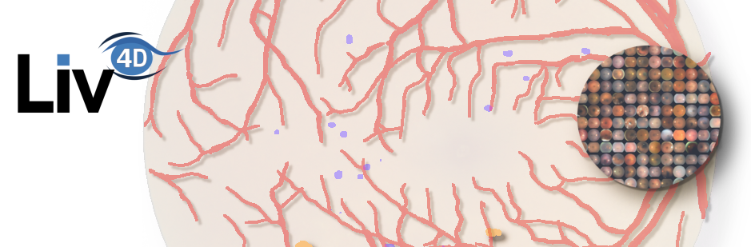

# Intepretability Toolkit

This repository serves as an illustration of the focused attention method. Note that this attribution method was found to work particularly well on fundus images (for the task of segmenting small structures like lesions). 

We kept this repository generic (the illustrations are done on ImageNet, with pretrained model from timm), which is not where focused attention shine the most. We provide some basic tools to compare attribution methods.


## Installation

```bash
git clone https://github.com/ClementPla/interpretability_toolkit/tree/main
cd interpretability-toolkit
pip install .
```

## Basic usecase

[See notebook](notebooks/interpretability.ipynb)